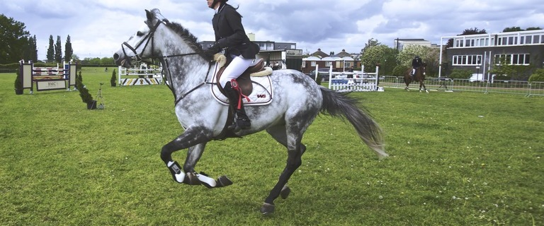
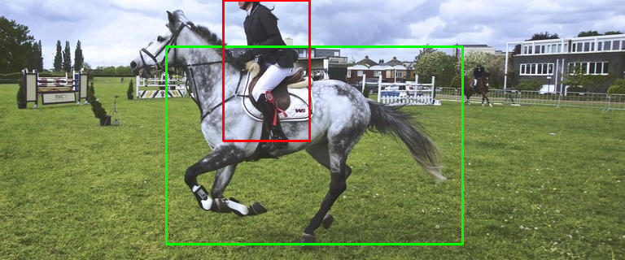

.. _examples:

********
Examples
********

.. list-table:: TIDL API Examples
   :header-rows: 1
   :widths: 12 43 20 25

   * - Example
     - Description
     - Compute cores
     - Input image
   * - one_eo_per_frame
     - Processes a single frame with one :term:`EO` using the j11_v2 network. Throughput is increased by distributing frame processing across EOs. Refer :ref:`use-case-1`.
     - EVE or C66x
     - Pre-processed image read from file.
   * - two_eo_per_frame
     - Processes a single frame with an :term:`EOP` using the j11_v2 network to reduce per-frame processing latency. Also increases throughput by distributing frame processing across EOPs. The EOP consists of two EOs. Refer :ref:`use-case-2`.
     - EVE and C66x (network is split across both EVE and C66x)
     - Pre-processed image read from file.
   * - two_eo_per_frame_opt
     - Builds on ``two_eo_per_frame``. Adds double buffering to improve performance. Refer :ref:`use-case-3`.
     - EVE and C66x (network is split across both EVE and C66x)
     - Pre-processed image read from file.

   * - imagenet
     - Classification example
     - EVE or C66x
     - OpenCV used to read input image from file or capture from camera.
   * - segmentation
     - Pixel level segmentation example
     - EVE or C66x
     - OpenCV used to read input image from file or capture from camera.
   * - ssd_multibox
     - Object detection
     - EVE and C66x (network is split across both EVE and C66x), EVE or C66x (full network on each core)
     - OpenCV used to read input image from file or capture from camera.
   * - mnist
     - handwritten digits recognition (MNIST).  This example illustrates
       low TIDL API overhead (~1.8%) for small networks with low compute
       requirements (<5ms).
     - EVE or C66x
     - Pre-processed white-on-black images read from file, with or without
       MNIST database file headers.
   * - classification
     - Classification example, called from the Matrix GUI.
     - EVE or C66x
     - OpenCV used to read input image from file or capture from camera.
   * - mcbench
     - Used to benchmark supported networks. Refer ``mcbench/scripts`` for command line options.
     - EVE or C66x
     - Pre-processed image read from file.
   * - layer_output
     - Illustrates using TIDL APIs to access output buffers of intermediate :term:`layers<Layer>` in the network.
     - EVE or C66x
     - Pre-processed image read from file.
   * - test
     - This example is used to test pre-converted networks included in the TIDL API package (``test/testvecs/config/tidl_models``). When run without any arguments, the program ``test_tidl`` will run all available networks on the C66x DSPs and EVEs available on the SoC. Use the ``-c`` option to specify a single network. Run ``test_tidl -h``  for details.
     - C66x and EVEs (if available)
     - Pre-processed image read from file.

The included examples demonstrate three categories of deep learning networks: classification, segmentation and object detection.  ``imagenet`` and ``segmentation`` can run on AM57x processors with either EVE or C66x cores.  ``ssd_multibox`` requires AM57x processors with both EVE and C66x. The examples are available at ``/usr/share/ti/tidl/examples`` on the EVM file system and in the linux devkit.

The performance numbers were obtained using:

* `AM574x IDK EVM`_ with the Sitara `AM5749`_ Processor - 2 Arm Cortex-A15 cores running at 1.0GHz, 2 EVE cores at 650MHz, and 2 C66x cores at 750MHz.
* `Processor SDK Linux`_ v5.1 with TIDL API v1.1

For each example, device processing time, host processing time,
and TIDL API overhead is reported.

* **Device processing time** is measured on the device, from the moment processing starts for a frame till processing finishes.
* **Host processing time** is measured on the host, from the moment ``ProcessFrameStartAsync()`` is called till ``ProcessFrameWait()`` returns in user application.  It includes the TIDL API overhead, the OpenCL runtime overhead, and the time to copy user input data into padded TIDL internal buffers. ``Host processing time = Device processing time + TIDL API overhead``.

Imagenet
--------

The imagenet example takes an image as input and outputs 1000 probabilities.
Each probability corresponds to one object in the 1000 objects that the
network is pre-trained with.  The example outputs top 5 (up to) predictions
with probabilities of 5% or higher for a given input image.

The following figure and tables shows an input image, top 5 predicted
objects as output, and the processing time on either EVE or C66x.

.. image:: ../../examples/test/testvecs/input/objects/cat-pet-animal-domestic-104827.jpeg
   :width: 600

==== ============== ===========
Rank Object Classes Probability
==== ============== ===========
1    tabby          52.55%
2    Egyptian_cat   21.18%
3    tiger_cat      17.65%
==== ============== ===========

=======   ====================== ==================== ============
Device    Device Processing Time Host Processing Time API Overhead
=======   ====================== ==================== ============
EVE       106.5 ms               107.9 ms             1.37 %
C66x      117.9 ms               118.7 ms             0.93 %
=======   ====================== ==================== ============

The :term:`network<Network>` used in the example is jacintonet11v2. It has
14 layers. Input to the network is RGB image of 224x224. Users can specify whether to run the network on EVE or C66x.

The example code sets ``buffer_factor`` to 2 to create duplicated
ExecutionObjectPipelines with identical ExecutionObjects to
perform double buffering, so that host pre/post-processing can be overlapped
with device processing (see comments in the code for details).
The following table shows the loop overall time over 10 frames
with single buffering and double buffering,
``./imagenet -f 10 -d <num> -e <num>``.

.. list-table:: Loop overall time over 10 frames
   :header-rows: 1

   * - Device(s)
     - Single Buffering (buffer_factor=1)
     - Double Buffering (buffer_factor=2)
   * - 1 EVE
     - 1744 ms
     - 1167 ms
   * - 2 EVEs
     - 966 ms
     - 795 ms
   * - 1 C66x
     - 1879 ms
     - 1281 ms
   * - 2 C66xs
     - 1021 ms
     - 814 ms

Segmentation
------------

The segmentation example takes an image as input and performs pixel-level
classification according to pre-trained categories.  The following figures
show a street scene as input and the scene overlaid with pixel-level
classifications as output: road in green, pedestrians in red, vehicles
in blue and background in gray.

.. image:: ../../examples/test/testvecs/input/roads/pexels-photo-972355.jpeg
   :width: 600

.. image:: images/pexels-photo-972355-seg.jpg
   :width: 600

The :term:`network<Network>` used in the example is jsegnet21v2. It has
26 layers.  Users can specify whether to run the network on EVE or C66x.
Input to the network is RGB image of size 1024x512.  The output is 1024x512
values, each value indicates which pre-trained category the current pixel
belongs to.  The example will take the network output, create an overlay,
and blend the overlay onto the original input image to create an output image.
From the reported time in the following table, we can see that this network
runs significantly faster on EVE than on C66x.

=======     ====================== ==================== ============
Device      Device Processing Time Host Processing Time API Overhead
=======     ====================== ==================== ============
EVE         251.8 ms               254.2 ms             0.96 %
C66x        812.7 ms               815.0 ms             0.27 %
=======     ====================== ==================== ============

The example code sets ``buffer_factor`` to 2 to create duplicated
ExecutionObjectPipelines with identical ExecutionObjects to
perform double buffering, so that host pre/post-processing can be overlapped
with device processing (see comments in the code for details).
The following table shows the loop overall time over 10 frames
with single buffering and double buffering,
``./segmentation -f 10 -d <num> -e <num>``.

.. list-table:: Loop overall time over 10 frames
   :header-rows: 1

   * - Device(s)
     - Single Buffering (buffer_factor=1)
     - Double Buffering (buffer_factor=2)
   * - 1 EVE
     - 5233 ms
     - 3017 ms
   * - 2 EVEs
     - 3032 ms
     - 3015 ms
   * - 1 C66x
     - 10890 ms
     - 8416 ms
   * - 2 C66xs
     - 5742 ms
     - 4638 ms

.. _ssd-example:

SSD
---

SSD is the abbreviation for Single Shot multi-box Detector.
The ssd_multibox example takes an image as input and detects multiple
objects with bounding boxes according to pre-trained categories.
The example supports the ssd network with two sets of pretrained categories:
``jdetnet_voc`` and ``jdetnet``.

The following figures show an image as input and the image with recognized
objects boxed as output from ``jdetnet_voc``: person in red and horse in green.

The following figures show another street scene as input and the scene
with recognized objects boxed as output from ``jdetnet``: pedestrians in red,
vehicles in blue and road signs in yellow.

.. image:: ../../examples/test/testvecs/input/roads/pexels-photo-378570.jpeg
   :width: 600

.. image:: images/pexels-photo-378570-ssd.jpg
   :width: 600

Please use command line options to switch between these two sets of pre-trained
categoris, e.g.

.. code-block:: shell

   ./ssd_multibox # default is jdetnet_voc 
   ./ssd_multibox -c jdetnet -l jdetnet_objects.json -p 16 -i ../test/testvecs/input/preproc_0_768x320.y

The ssd network used in both categories has 43 layers.
Input to the network is RGB image of size 768x320.  Output is a list of
boxes (up to 20), each box has information about the box coordinates, and
which pre-trained category that the object inside the box belongs to.
The example will take the network output, draw boxes accordingly,
and create an output image.
The network can be run entirely on either EVE or C66x.  However, the best
performance comes with running the first 30 layers as a group on EVE
and the next 13 layers as another group on C66x.
Our end-to-end example shows how easy it is to assign a :term:`Layer Group` id
to an :term:`Executor` and how easy it is to construct an :term:`ExecutionObjectPipeline` to connect the output of one *Executor*'s :term:`ExecutionObject`
to the input of another *Executor*'s *ExecutionObject*.

========      ====================== ==================== ============
Device        Device Processing Time Host Processing Time API Overhead
========      ====================== ==================== ============
EVE+C66x      169.5ms                172.0ms              1.68 %
========      ====================== ==================== ============

The example code sets ``pipeline_depth`` to 2 to create duplicated
ExecutionObjectPipelines with identical ExecutionObjects to
perform pipelined execution at the ExecutionObject level.
The side effect is that it also overlaps host pre/post-processing
with device processing (see comments in the code for details).
The following table shows the loop overall time over 10 frames
with pipelining at ExecutionObjectPipeline level
versus ExecutionObject level.
``./ssd_multibox -f 10 -d <num> -e <num>``.

.. list-table:: Loop overall time over 10 frames
   :header-rows: 1

   * - Device(s)
     - pipeline_depth=1
     - pipeline_depth=2
   * - 1 EVE + 1 C66x
     - 2900 ms
     - 1735 ms
   * - 2 EVEs + 2 C66xs
     - 1630 ms
     - 1408 ms

When there is a requirement to run the SSD networks non-partitioned,
for example, the SoC only has C66x cores but not EVE cores,
use ``-e 0`` to run the full network only on C66x cores, without partitioning.
When running full network with C66x DSP cores, jdetnet works fine with default
heap sizes.  jdetnet_voc requires slightly larger heap size and can be run
with environment variable, e.g.
``TIDL_NETWORK_HEAP_SIZE_DSP=75000000 ./ssd_multibox -d 1 -e 0``.

.. _mnist-example:

MNIST
-----

The MNIST example takes a pre-processed 28x28 white-on-black frame from
a file as input and predicts the hand-written digit in the frame.
For example, the example will predict 0 for the following frame.

.. code-block:: none

    root@am57xx-evm:~/tidl/examples/mnist# hexdump -v -e '28/1 "%2x" "\n"' -n 784 ../test/testvecs/input/digits10_images_28x28.y
     0 0 0 0 0 0 0 0 0 0 0 0 0 0 0 0 0 0 0 0 0 0 0 0 0 0 0 0
     0 0 0 0 0 0 0 0 0 0 0 0 0 0 0 0 0 0 0 0 0 0 0 0 0 0 0 0
     0 0 0 0 0 0 0 0 0 0 0 0 0 0 3 314 8 0 0 0 0 0 0 0 0 0 0
     0 0 0 0 0 0 0 0 0 0 0 0319bdfeec1671b 0 0 0 0 0 0 0 0 0
     0 0 0 0 0 0 0 0 0 0 01ed5ffd2a4e4ec89 0 0 0 0 0 0 0 0 0
     0 0 0 0 0 0 0 0 0 0 1bcffee2a 031e6e225 0 0 0 0 0 0 0 0
     0 0 0 0 0 0 0 0 0 05ff7ffbf 2 0 078ffa1 0 0 0 0 0 0 0 0
     0 0 0 0 0 0 0 0 0 0b2f2f34e 0 0 015e0d8 0 0 0 0 0 0 0 0
     0 0 0 0 0 0 0 0 0148deab2 0 0 0 0 0bdec 2 0 0 0 0 0 0 0
     0 0 0 0 0 0 0 0 0 084f845 0 0 0 0 0a4f222 0 0 0 0 0 0 0
     0 0 0 0 0 0 0 0 0 0c4d3 5 0 0 0 0 096f21c 0 0 0 0 0 0 0
     0 0 0 0 0 0 0 0 052f695 0 0 0 0 0 0a7ed 8 0 0 0 0 0 0 0
     0 0 0 0 0 0 0 0 09af329 0 0 0 0 0 0d1cf 0 0 0 0 0 0 0 0
     0 0 0 0 0 0 0 0 2d4c8 0 0 0 0 0 01ae9a2 0 0 0 0 0 0 0 0
     0 0 0 0 0 0 0 038fa9a 0 0 0 0 0 062ff76 0 0 0 0 0 0 0 0
     0 0 0 0 0 0 0 07afe5d 0 0 0 0 0 0a9e215 0 0 0 0 0 0 0 0
     0 0 0 0 0 0 0 0bdec1d 0 0 0 0 017e7aa 0 0 0 0 0 0 0 0 0
     0 0 0 0 0 0 0 1e7d6 0 0 0 0 0 096f85a 0 0 0 0 0 0 0 0 0
     0 0 0 0 0 0 01df2bf 0 0 0 0 015e1ca 0 0 0 0 0 0 0 0 0 0
     0 0 0 0 0 0 061fc95 0 0 0 0 084f767 0 0 0 0 0 0 0 0 0 0
     0 0 0 0 0 0 06eff8b 0 0 0 033e8ca 4 0 0 0 0 0 0 0 0 0 0
     0 0 0 0 0 0 060fc9e 0 0 0 092d63e 0 0 0 0 0 0 0 0 0 0 0
     0 0 0 0 0 0 01bf1da 6 0 019b656 0 0 0 0 0 0 0 0 0 0 0 0
     0 0 0 0 0 0 0 0c3fb8e a613e7b 5 0 0 0 0 0 0 0 0 0 0 0 0
     0 0 0 0 0 0 0 049f1fcf5f696 9 0 0 0 0 0 0 0 0 0 0 0 0 0
     0 0 0 0 0 0 0 0 04ca0b872 1 0 0 0 0 0 0 0 0 0 0 0 0 0 0
     0 0 0 0 0 0 0 0 0 0 0 0 0 0 0 0 0 0 0 0 0 0 0 0 0 0 0 0
     0 0 0 0 0 0 0 0 0 0 0 0 0 0 0 0 0 0 0 0 0 0 0 0 0 0 0 0

The file can contain multiple frames.  If an optional label file is also
given, the example will compare predicted result against pre-determined
label for accuracy.  The input files may or may not have `MNIST dataset
file headers <http://yann.lecun.com/exdb/mnist/>`_.  If using headers,
input filenames must end with idx3-ubyte or idx1-ubyte.

The MNIST example also illustrates low overhead of TIDL API for small
networks with low compute requirements (<5ms).  The network runs about 3ms
on EVE for a single frame.  As shown in the following table, when running
over 1000 frames, the overhead is about 1.8%.

.. list-table:: Loop overall time over 1000 frames
   :header-rows: 1

   * - Device(s)
     - Device Processing Time
     - Host Processing Time
     - API Overhead
   * - 1 EVE
     - 3091 ms
     - 3146 ms
     - 1.78%

Running Examples
----------------

The examples are located in ``/usr/share/ti/tidl/examples`` on
the EVM file system.  **Each example needs to be run in its own directory** due to relative paths to configuration files.
Running an example with ``-h`` will show help message with option set.
The following listing illustrates how to build and run the examples.

.. code-block:: shell

   root@am57xx-evm:~/tidl/examples/imagenet# ./imagenet
   Input: ../test/testvecs/input/objects/cat-pet-animal-domestic-104827.jpeg
   1: tabby,   prob = 52.55%
   2: Egyptian_cat,   prob = 21.18%
   3: tiger_cat,   prob = 17.65%
   Loop total time (including read/write/opencv/print/etc):  183.3ms
   imagenet PASSED

   root@am57xx-evm:~/tidl-api/examples/segmentation# ./segmentation
   Input: ../test/testvecs/input/000100_1024x512_bgr.y
   frame[  0]: Time on EVE0: 251.74 ms, host: 258.02 ms API overhead: 2.43 %
   Saving frame 0 to: frame_0.png
   Saving frame 0 overlayed with segmentation to: overlay_0.png
   frame[  1]: Time on EVE0: 251.76 ms, host: 255.79 ms API overhead: 1.58 %
   Saving frame 1 to: frame_1.png
   Saving frame 1 overlayed with segmentation to: overlay_1.png
   ...
   frame[  8]: Time on EVE0: 251.75 ms, host: 254.21 ms API overhead: 0.97 %
   Saving frame 8 to: frame_8.png
   Saving frame 8 overlayed with segmentation to: overlay_8.png
   Loop total time (including read/write/opencv/print/etc):   4809ms
   segmentation PASSED

   root@am57xx-evm:~/tidl-api/examples/ssd_multibox# ./ssd_multibox
   Input: ../test/testvecs/input/preproc_0_768x320.y
   frame[  0]: Time on EVE0+DSP0: 169.44 ms, host: 173.56 ms API overhead: 2.37 %
   Saving frame 0 to: frame_0.png
   Saving frame 0 with SSD multiboxes to: multibox_0.png
   Loop total time (including read/write/opencv/print/etc):  320.2ms
   ssd_multibox PASSED

   root@am57xx-evm:~/tidl/examples/mnist# ./mnist
   Input images: ../test/testvecs/input/digits10_images_28x28.y
   Input labels: ../test/testvecs/input/digits10_labels_10x1.y
   0
   1
   2
   3
   4
   5
   6
   7
   8
   9
   Device total time:  31.02ms
   Loop total time (including read/write/print/etc):  32.49ms
   Accuracy:    100%
   mnist PASSED

Image input
^^^^^^^^^^^

The image input option, ``-i <image>``, takes an image file as input.
You can supply an image file with format that OpenCV can read, since
we use OpenCV for image pre/post-processing.  When ``-f <number>`` option
is used, the same image will be processed repeatedly.

Camera (live video) input
^^^^^^^^^^^^^^^^^^^^^^^^^

The input option, ``-i camera<number>``, enables live frame inputs
from camera.  ``<number>`` is the video input port number
of your camera in Linux.  Use the following command to check video
input ports.  The number defaults to ``1`` for TMDSCM572X camera module
used on AM57x EVMs.  You can use ``-f <number>`` to specify the number
of frames you want to process.

.. code-block:: shell

  root@am57xx-evm:~# v4l2-ctl --list-devices
  omapwb-cap (platform:omapwb-cap):
        /dev/video11

  omapwb-m2m (platform:omapwb-m2m):
        /dev/video10

  vip (platform:vip):
        /dev/video1

  vpe (platform:vpe):
        /dev/video0

Pre-recorded video (mp4/mov/avi) input
^^^^^^^^^^^^^^^^^^^^^^^^^^^^^^^^^^^^^^

The input option, ``-i <name>.{mp4,mov,avi}``, enables frame inputs from
pre-recorded video file in mp4, mov or avi format.  If you have a video in
a different OpenCV-supported format/suffix, you can simply create a softlink
with one of the mp4, mov or avi suffixes and feed it into the example.
Again, use ``-f <number>`` to specify the number of frames you want to process.

Displaying video output
^^^^^^^^^^^^^^^^^^^^^^^

When using video input, live or pre-recorded, the example will display
the output in a window using OpenCV.  If you have a LCD screen attached
to the EVM, you will need to kill the ``matrix-gui`` first in order to
see the example display window, as shown in the following example.

.. code-block:: shell

  root@am57xx-evm:/usr/share/ti/tidl/examples/ssd_multibox# /etc/init.d/matrix-gui-2.0 stop
  Stopping Matrix GUI application.
  root@am57xx-evm:/usr/share/ti/tidl/examples/ssd_multibox# ./ssd_multibox -i camera -f 100
  Input: camera
  init done
  Using Wayland-EGL
  wlpvr: PVR Services Initialised
  Using the 'xdg-shell-v5' shell integration
  ... ...
  root@am57xx-evm:/usr/share/ti/tidl/examples/ssd_multibox# /etc/init.d/matrix-gui-2.0 start
  /usr/share/ti/tidl/examples/ssd_multibox
  Removing stale PID file /var/run/matrix-gui-2.0.pid.
  Starting Matrix GUI application.

.. _AM574x IDK EVM:  http://www.ti.com/tool/tmdsidk574
.. _AM5749: http://www.ti.com/product/AM5749/
.. _Processor SDK Linux: http://software-dl.ti.com/processor-sdk-linux/esd/AM57X/latest/index_FDS.html
