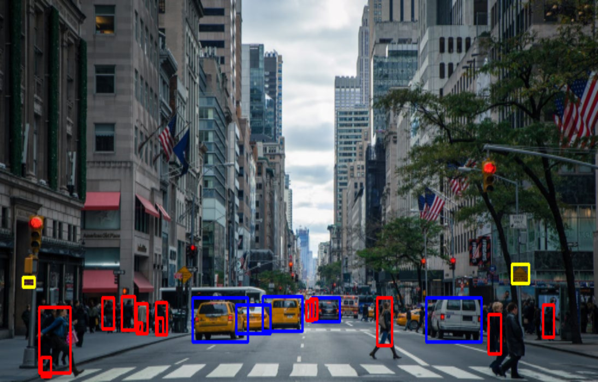

********
Examples
********

We ship three end-to-end examples within the tidl-api package
to demonstrate three categories of deep learning networks.  The first
two examples can run on AM57x SoCs with either EVE or DSP.  The last
example requires AM57x SoCs with both EVE and DSP.  The performance
numbers that we present here were obtained on an AM5729 EVM, which
includes 2 ARM A15 cores running at 1.5GHz, 4 EVE cores at 535MHz, and
2 DSP cores at 750MHz.

Imagenet
--------

The imagenet example takes an image as input and outputs 1000 probabilities.
Each probability corresponds to one object in the 1000 objects that the
network is pre-trained with.  Our example outputs top 5 probabilities
as the most likely objects that the input image can be.

The following figure and tables shows an input image, top 5 predicted
objects as output, and the processing time on either EVE or DSP.

.. image:: ../../examples/test/testvecs/input/objects/cat-pet-animal-domestic-104827.jpeg
   :width: 600

.. table::

    ==== ============== ============
    Rank Object Classes Probability
    ==== ============== ============
    1    tabby          0.996
    2    Egyptian_cat   0.977
    3    tiger_cat      0.973
    4    lynx           0.941
    5    Persian_cat    0.922
    ==== ============== ============

.. table::

   ====================== ==================== ============
   Device Processing Time Host Processing Time API Overhead
   ====================== ==================== ============
   EVE: 123.1 ms          124.7 ms             1.34 %
   **OR**
   DSP: 117.9 ms          119.3 ms             1.14 %
   ====================== ==================== ============

The particular network that we ran in this category, jacintonet11v2,
has 14 layers.  User can specify whether to run the network on EVE or DSP
for acceleration.  We can see that EVE time is slightly higher than DSP time.
Host time includes the OpenCL runtime overhead and the time to copy user
input data into padded TIDL buffers.  We can see that the overall overhead
is less than 1.5%.

Segmentation
------------

The segmentation example takes an image as input and performs pixel-level
classification according to pre-trained categories.  The following figures
show a street scene as input and the scene overlaid with pixel-level
classifications as output: road in green, pedestrians in red, vehicles
in blue and background in gray.

The network we ran in this category is jsegnet21v2, which has 26 layers.
From the reported time in the following table, we can see that this network
runs significantly faster on EVE than on DSP.

.. table::

   ====================== ==================== ============
   Device Processing Time Host Processing Time API Overhead
   ====================== ==================== ============
   EVE: 296.5 ms          303.3 ms             2.26 %
   **OR**
   DSP: 812.0 ms          818.4 ms             0.79 %
   ====================== ==================== ============

.. _ssd-example:

SSD
---

SSD is the abbreviation for Single Shot multi-box Detector.
The ssd_multibox example takes an image as input and detects multiple
objects with bounding boxes according to pre-trained categories.
The following figures show another street scene as input and the scene
with recognized objects boxed as output: pedestrians in red,
vehicles in blue and road signs in yellow.

The network can be run entirely on either EVE or DSP.  But the best
performance comes with running the first 30 layers on EVE and the
next 13 layers on DSP, for this particular jdetnet_ssd network.
Note the **AND** in the following table for the reported time.
Our end-to-end example shows how easy it is to assign a layers group id
to an *Executor* and how easy it is to connect the output from one
*ExecutionObject* to the input to another *ExecutionObject*.

.. table::

   ====================== ==================== ============
   Device Processing Time Host Processing Time API Overhead
   ====================== ==================== ============
   EVE: 175.2 ms          179.1 ms             2.14 %
   **AND**
   DSP:  21.1 ms           22.3 ms             5.62 %
   ====================== ==================== ============

Running Examples
----------------

The examples are located in ``/usr/share/ti/tidl-api/examples`` on
the EVM file system.  Each example needs to be run its own directory.
Running an example with ``-h`` will show help message with option set.
The following code section shows how to run the examples, and
the test program that tests all supported TIDL network configs.

.. code:: shell

   root@am57xx-evm:~# cd /usr/share/ti/tidl-api/examples/imagenet/
   root@am57xx-evm:/usr/share/ti/tidl-api/examples/imagenet# make -j4
   root@am57xx-evm:/usr/share/ti/tidl-api/examples/imagenet# ./imagenet -t d
   Input: ../test/testvecs/input/objects/cat-pet-animal-domestic-104827.jpeg
   frame[0]: Time on device:  117.9ms, host:  119.3ms API overhead:   1.17 %
   1: tabby, prob = 0.996
   2: Egyptian_cat, prob = 0.977
   3: tiger_cat, prob = 0.973
   4: lynx, prob = 0.941
   5: Persian_cat, prob = 0.922
   imagenet PASSED

   root@am57xx-evm:/usr/share/ti/tidl-api/examples/imagenet# cd ../segmentation/; make -j4
   root@am57xx-evm:/usr/share/ti/tidl-api/examples/segmentation# ./segmentation -i ../test/testvecs/input/roads/pexels-photo-972355.jpeg
   Input: ../test/testvecs/input/roads/pexels-photo-972355.jpeg
   frame[0]: Time on device:  296.5ms, host:  303.2ms API overhead:   2.21 %
   Saving frame 0 overlayed with segmentation to: overlay_0.png
   segmentation PASSED

   root@am57xx-evm:/usr/share/ti/tidl-api/examples/segmentation# cd ../ssd_multibox/; make -j4
   root@am57xx-evm:/usr/share/ti/tidl-api/examples/ssd_multibox# ./ssd_multibox -i ../test/testvecs/input/roads/pexels-photo-378570.jpeg
   Input: ../test/testvecs/input/roads/pexels-photo-378570.jpeg
   frame[0]: Time on EVE:  175.2ms, host:    179ms API overhead:    2.1 %
   frame[0]: Time on DSP:  21.06ms, host:  22.43ms API overhead:   6.08 %
   Saving frame 0 with SSD multiboxes to: multibox_0.png
   Loop total time (including read/write/print/etc):  423.8ms
   ssd_multibox PASSED

   root@am57xx-evm:/usr/share/ti/tidl-api/examples/ssd_multibox# cd ../test; make -j4
   root@am57xx-evm:/usr/share/ti/tidl-api/examples/test# ./test_tidl
   API Version: 01.00.00.d91e442
   Running dense_1x1 on 2 devices, type EVE
   frame[0]: Time on device:  134.3ms, host:  135.6ms API overhead:  0.994 %
   dense_1x1 : PASSED
   Running j11_bn on 2 devices, type EVE
   frame[0]: Time on device:  176.2ms, host:  177.7ms API overhead:  0.835 %
   j11_bn : PASSED
   Running j11_cifar on 2 devices, type EVE
   frame[0]: Time on device:  53.86ms, host:  54.88ms API overhead:   1.85 %
   j11_cifar : PASSED
   Running j11_controlLayers on 2 devices, type EVE
   frame[0]: Time on device:  122.9ms, host:  123.9ms API overhead:  0.821 %
   j11_controlLayers : PASSED
   Running j11_prelu on 2 devices, type EVE
   frame[0]: Time on device:  300.8ms, host:  302.1ms API overhead:  0.437 %
   j11_prelu : PASSED
   Running j11_v2 on 2 devices, type EVE
   frame[0]: Time on device:  124.1ms, host:  125.6ms API overhead:   1.18 %
   j11_v2 : PASSED
   Running jseg21 on 2 devices, type EVE
   frame[0]: Time on device:    367ms, host:    374ms API overhead:   1.88 %
   jseg21 : PASSED
   Running jseg21_tiscapes on 2 devices, type EVE
   frame[0]: Time on device:  302.2ms, host:  308.5ms API overhead:   2.02 %
   frame[1]: Time on device:  301.9ms, host:  312.5ms API overhead:   3.38 %
   frame[2]: Time on device:  302.7ms, host:  305.9ms API overhead:   1.04 %
   frame[3]: Time on device:  301.9ms, host:    305ms API overhead:   1.01 %
   frame[4]: Time on device:  302.7ms, host:  305.9ms API overhead:   1.05 %
   frame[5]: Time on device:  301.9ms, host:  305.5ms API overhead:   1.17 %
   frame[6]: Time on device:  302.7ms, host:  305.9ms API overhead:   1.06 %
   frame[7]: Time on device:  301.9ms, host:    305ms API overhead:   1.02 %
   frame[8]: Time on device:    297ms, host:  300.3ms API overhead:   1.09 %
   Comparing frame: 0
   jseg21_tiscapes : PASSED
   Running smallRoi on 2 devices, type EVE
   frame[0]: Time on device:  2.548ms, host:  3.637ms API overhead:   29.9 %
   smallRoi : PASSED
   Running squeeze1_1 on 2 devices, type EVE
   frame[0]: Time on device:  292.9ms, host:  294.6ms API overhead:  0.552 %
   squeeze1_1 : PASSED

   Multiple Executor...
   Running network tidl_config_j11_v2.txt on EVEs: 1  in thread 0
   Running network tidl_config_j11_cifar.txt on EVEs: 0  in thread 1
   Multiple executors: PASSED
   Running j11_bn on 2 devices, type DSP
   frame[0]: Time on device:  170.5ms, host:  171.5ms API overhead:  0.568 %
   j11_bn : PASSED
   Running j11_controlLayers on 2 devices, type DSP
   frame[0]: Time on device:  416.4ms, host:  417.1ms API overhead:  0.176 %
   j11_controlLayers : PASSED
   Running j11_v2 on 2 devices, type DSP
   frame[0]: Time on device:    118ms, host:  119.2ms API overhead:   1.01 %
   j11_v2 : PASSED
   Running jseg21 on 2 devices, type DSP
   frame[0]: Time on device:   1123ms, host:   1128ms API overhead:  0.443 %
   jseg21 : PASSED
   Running jseg21_tiscapes on 2 devices, type DSP
   frame[0]: Time on device:  812.3ms, host:  817.3ms API overhead:  0.614 %
   frame[1]: Time on device:  812.6ms, host:  818.6ms API overhead:  0.738 %
   frame[2]: Time on device:  812.3ms, host:  815.1ms API overhead:  0.343 %
   frame[3]: Time on device:  812.7ms, host:  815.2ms API overhead:  0.312 %
   frame[4]: Time on device:  812.3ms, host:  815.1ms API overhead:  0.353 %
   frame[5]: Time on device:  812.6ms, host:  815.1ms API overhead:  0.302 %
   frame[6]: Time on device:  812.2ms, host:  815.1ms API overhead:  0.357 %
   frame[7]: Time on device:  812.6ms, host:  815.2ms API overhead:  0.315 %
   frame[8]: Time on device:    812ms, host:    815ms API overhead:  0.367 %
   Comparing frame: 0
   jseg21_tiscapes : PASSED
   Running smallRoi on 2 devices, type DSP
   frame[0]: Time on device:  14.21ms, host:  14.94ms API overhead:   4.89 %
   smallRoi : PASSED
   Running squeeze1_1 on 2 devices, type DSP
   frame[0]: Time on device:    960ms, host:  961.1ms API overhead:  0.116 %
   squeeze1_1 : PASSED
   tidl PASSED
