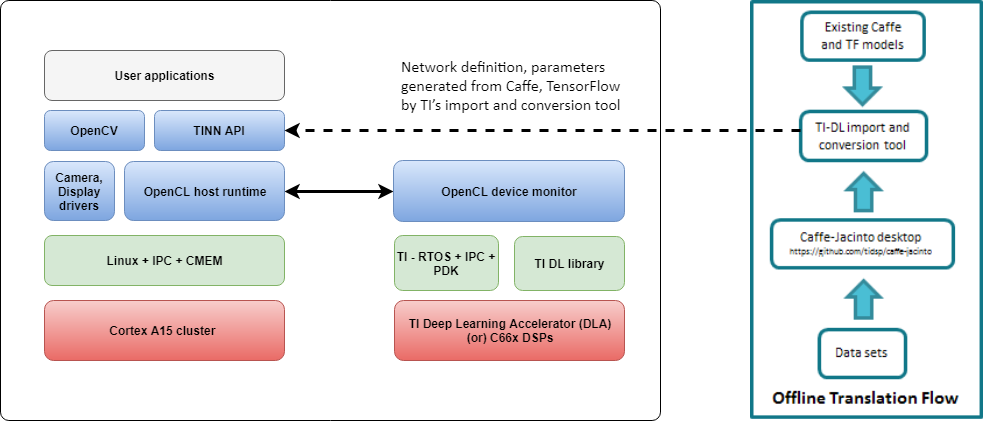

************
Introduction
************

The TI Neural Network (TINN) API is a C++ API to abstract lower level OpenCL host APIs for custom devices. The TINN API enables AM57x applications to leverage DLAs or DSPs for deep learning. The API:

* Enables easy integration of  TINN into other frameworks such as OpenCV
* Is low overhead - OpenCL APIs account for ~1.5% of overall per frame processing time (224x224 frame with 3 channels) 
* Provides an example of using the OpenCL DLAs custom device kernels
* Provides a common abstraction for running networks on DLAs or C66x DSPs

OpenCL v1.2 added support for custom devices. The OpenCL runtime for a custom device implements the standard OpenCL host API functions. However, a custom device does not support OpenCL-C programs. Host programs can invoke a fixed set of kernels built into the runtime. The DLAs on AM57x SoCs are modeled as OpenCL custom devices with a fixed set of built-in kernels.

The figure below describes the relationship between TINN APIs, the user's application and OpenCL host APIs.

The API consistes of 3 classes with simple user interfaces:

* Configuration
* Executor
* ExecutionObject

.. note::
    DLA: TI Deep Learning Accelerator, also known as EVE.

