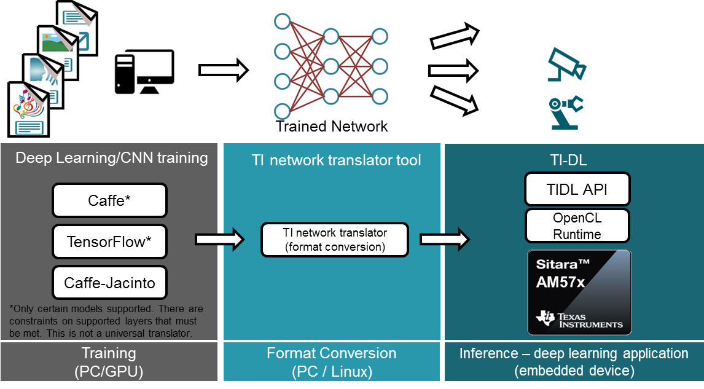
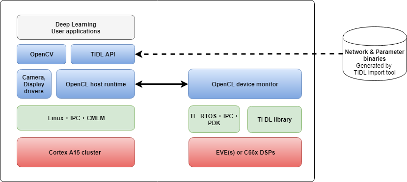

************
Introduction
************

TI Deep Learning (TIDL) API brings deep learning to the edge by enabling applications to leverage TI's proprietary, highly optimized CNN/DNN implementation on the EVE and C66x DSP compute engines. TIDL will initially target Vision/2D use cases on AM57x SoCs.

This User's Guide covers the TIDL API. For information on TIDL such as the overall development flow, techniques to optimize performance of CNN/DNN on TI's SoCs,performance/benchmarking data and list of supported layers, see the TIDL section in the `Processor SDK Linux Software Developer's Guide`_.

.. note::
    TIDL API is available only on AM57x SoCs. It requires OpenCL version 1.1.15.1 or higher.

Key Features
------------
Ease of use
+++++++++++
* Easily integrate TIDL APIs into other frameworks such as `OpenCV`_
* Provides a common host abstraction for user applications across multiple compute engines (EVEs and C66x DSPs)

Low overhead
+++++++++++++
The execution time of TIDL APIs on the host is a fairly small percentage of the overall per-frame execution time. For example, with jseg21 network, 1024x512 frame with 3 channels, the APIs account for ~1.5% of overall per-frame processing time.

Software Architecture
---------------------
The TIDL API leverages TI's `OpenCL`_ product to offload deep learning applications to both EVE(s) and DSP(s).  The TIDL API significantly improves the out-of-box deep learning experience for users and enables them to focus on their overall use case. They do not have to spend time on the mechanics of ARM ↔ DSP/EVE communication or implementing optimized network layers on EVE(s) and/or DSP(s).  The API allows customers to easily integrate frameworks such as OpenCV and rapidly prototype deep learning applications.

.. _`TIDL Development flow`:

    Development flow with TIDL APIs

:numref:`TIDL Development flow` shows the overall development process. Deep learning consists to two stages: training at development stage and inference at deployment stage.  Training involves designing neural network model, running training data through the network to tune the model parameters.  Inference takes the pre-trained model including parameters, applies to new input and produces output.  Training is computationally intensive and is done using frameworks such as Caffe/TensorFlow. Once the network is trained, the TIDL converter tool can be used to translate the network and parameters to TIDL. The `Processor SDK Linux Software Developer's Guide`_ provides details on the development flow and and the converter tool. The converter tool generates a TIDL network binary file and model or parameter file. The network file specifies the network graph. The parameter file specifies the weights.

:numref:`TIDL API Software Architecture` shows the TIDL API software architecture.

.. _`TIDL API Software Architecture`:

    TIDL API Software Architecture

TIDL APIs provide three intuitive C++ classes.  ``Configuration`` encapsulates a network configuration, including pointers to the network and parameter binary files.  ``Executor`` encapsulates on-device memory allocation, network setup and initialization.  ``ExecutionObject`` encapsulates TIDL processing on a single DSP or EVE core.  Implementation of these classes will call into OpenCL runtime to offload network processing onto EVE/DSP devices, abstracting these details from the user.

:numref:`simple-example` illustrates how easy it is to use TIDL APIs to leverage deep learning application in user applications.  In this example, a configuration object is created from reading a TIDL network config file.  An executor object is created with two EVE devices.  It uses the configuration object to setup and initialize TIDL network on EVEs.  Each of the two execution objects dispatches TIDL processing to a different EVE core.  Because the OpenCL kernel execution is asynchronous, we can pipeline the frames across two EVEs.  When one frame is being processed by a EVE, the next frame can be processed by another EVE.

.. code-block:: c++
    :caption: Application using TIDL APIs
    :name: simple-example

    // Read a TI DL network configuration file
    Configuration configuration;
    bool status = configuration.ReadFromFile(“./tidl_j11v2_net");

    // Create an executor with 2 EVEs and configuration
    DeviceIds ids = {DeviceId::ID0, DeviceId::ID1};
    Executor executor(DeviceType::EVE, ids, configuration);

    // Query Executor for set of ExecutionObjects created
    const ExecutionObjects& eos = executor.GetExecutionObjects();
    int num_eos = eos.size();  // 2 EVEs

    // Allocate input and output buffers for each execution object
    for (auto &eo : eos)
    {
         ArgInfo in(eo->GetInputBufferSizeInBytes());
         ArgInfo out(eo->GetOutputBufferSizeInBytes());
         eo->SetInputOutputBuffer(in, out);
    }

    // Pipelined processing with 2 EVE cores
    for (int idx = 0; idx < configuration.numFrames + num_eos; idx++)
    {
        ExecutionObject* eo = eos[idx % num_eos].get();

        // Wait for previous frame on the same eo to finish processing
        if (eo->ProcessFrameWait())  WriteFrameOutput(*eo);

        // Read a frame and start processing it with current eo
        if (ReadFrameInput(*eo, idx))  eo->ProcessFrameStartAsync();
    }

``ReadFrameInput`` and ``WriteFrameOutput`` functions are used to read an input frame and write the result of processing. For example, with OpenCV, ``ReadFrameInput`` is implemented using OpenCV APIs to capture a frame. To execute the same network on DSPs, the only change to :numref:`simple-example` is to replace ``DeviceType::EVE`` with ``DeviceType::DSP``.

Section :ref:`using-tidl-api` contains details on using the APIs. The APIs themselves are documented in section :ref:`api-documentation`.

Sometimes it is beneficial to partition a network and run different parts on different cores because some types of layers could run faster on EVEs while other types could run faster on DSPs.  TIDL APIs provide the flexibility to run partitioned network across EVEs and DSPs. Refer the :ref:`ssd-example` example for details.

.. _Processor SDK Linux Software Developer's Guide: http://software-dl.ti.com/processor-sdk-linux/esd/docs/latest/linux/index.html
.. _OpenCV: http://software-dl.ti.com/processor-sdk-linux/esd/docs/latest/linux/Foundational_Components.html#opencv
.. _OpenCL: http://software-dl.ti.com/mctools/esd/docs/opencl/index.html
