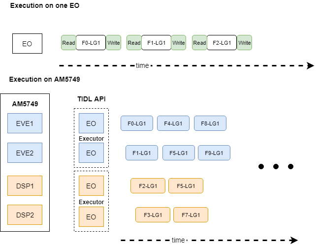
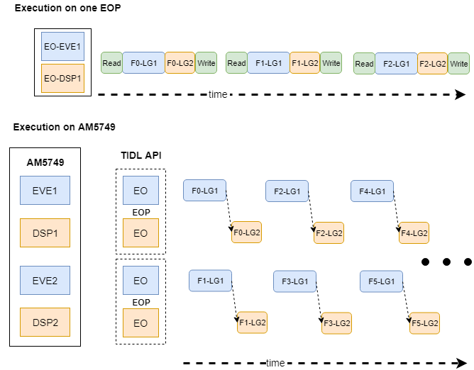
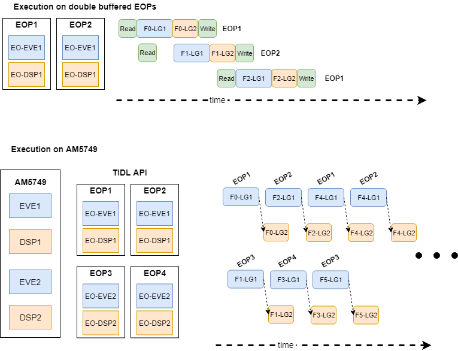

.. _using-tidl-api:

*************
Using the API
*************

This section illustrates using TIDL APIs to leverage deep learning in user applications. The overall flow is as follows:

* Create a :term:`Configuration` object to specify the set of parameters required for network exectution.
* Create :term:`Executor` objects - one to manage overall execution on the EVEs, the other for C66x DSPs.
* Use the :term:`Execution Objects<EO>` (EO) created by the Executor to process :term:`frames<Frame>`. There are two approaches to processing frames using Execution Objects:

.. list-table:: TIDL API Use Cases
   :header-rows: 1
   :widths: 30 50 20

   * - Use Case
     - Application/Network characteristic
     - Examples
   * - Each :term:`EO` processes a single frame. The network consists of a single :term:`Layer Group` and the entire Layer Group is processed on a single EO. See :ref:`use-case-1`.
     -

       * The latency to run the network on a single frame meets application requirements
       * If frame processing time is fairly similar across EVE and C66x, multiple EOs can be used to increase throughtput
       * The latency to read an input frame can be hidden by using 2 :term:`EOPs<EOP>` with the same :term:`EO`.
     - one_eo_per_frame, imagenet, segmentation

   * - Split processing a single frame across multiple :term:`EOs<EO>` using an :term:`ExecutionObjectPipeline`.  The network consists of 2 or more :term:`Layer Groups<Layer Group>`. See :ref:`use-case-2` and :ref:`use-case-3`.
     -

       * Network execution must be split across EVE and C66x to meet single frame latency requirements.
       * Split processing a single frame across multiple :term:`EOs<EO>` using an :term:`ExecutionObjectPipeline`.
       * Splitting can lower the overall latency because memory bound :term:`layers<Layer>` tend to run faster on the C66x.
     - two_eo_per_frame, two_eo_per_frame_opt, ssd_multibox

Refer Section :ref:`api-documentation` for API documentation.

Use Cases
+++++++++

.. _use-case-1:

Each EO processes a single frame
================================

In this approach, the :term:`network<Network>` is set up as a single :term:`Layer Group`. An :term:`EO` runs the entire layer group on a single frame. To increase throughput, frame processing can be pipelined across available EOs. For example, on AM5749, frames can be processed by 4 EOs: one each on EVE1, EVE2, DSP1, and DSP2.

    Processing a frame with one EO. Not to scale. Fn: Frame n, LG: Layer Group.

#. Determine if there are any TIDL capable :term:`compute cores<Compute core>` on the AM57x Processor:

    .. literalinclude:: ../../examples/one_eo_per_frame/main.cpp
        :language: c++
        :lines: 64-65
        :linenos:

#. Create a Configuration object by reading it from a file or by initializing it directly. The example below parses a configuration file and initializes the Configuration object. See ``examples/test/testvecs/config/infer`` for examples of configuration files.

    .. literalinclude:: ../../examples/one_eo_per_frame/main.cpp
        :language: c++
        :lines: 97-99
        :linenos:

#. Create Executor on C66x and EVE. In this example, all available C66x and EVE  cores are used (lines 2-3 and :ref:`CreateExecutor`).
#. Create a vector of available ExecutionObjects from both Executors (lines 7-8 and :ref:`CollectEOs`).
#. Allocate input and output buffers for each ExecutionObject (:ref:`AllocateMemory`)
#. Run the network on each input frame.  The frames are processed with available execution objects in a pipelined manner. The additional num_eos iterations are required to flush the pipeline (lines 15-26).

   * Wait for the EO to finish processing. If the EO is not processing a frame (the first iteration on each EO), the call to ``ProcessFrameWait`` returns false. ``ReportTime`` is used to report host and device execution times.
   * Read a frame and start running the network. ``ProcessFrameStartAsync`` is asynchronous and returns before processing is complete. ``ReadFrame`` is application specific and used to read an input frame for processing. For example, with OpenCV, ``ReadFrame`` is implemented using OpenCV APIs to capture a frame from the camera.

    .. literalinclude:: ../../examples/one_eo_per_frame/main.cpp
        :language: c++
        :lines: 113-132,134,138-142
        :linenos:

    .. literalinclude:: ../../examples/one_eo_per_frame/main.cpp
        :language: c++
        :lines: 159-168
        :linenos:
        :caption: CreateExecutor
        :name: CreateExecutor

    .. literalinclude:: ../../examples/one_eo_per_frame/main.cpp
        :language: c++
        :lines: 171-177
        :linenos:
        :caption: CollectEOs
        :name: CollectEOs

    .. literalinclude:: ../../examples/common/utils.cpp
        :language: c++
        :lines: 176-191
        :linenos:
        :caption: AllocateMemory
        :name: AllocateMemory

The complete example is available at ``/usr/share/ti/tidl/examples/one_eo_per_frame/main.cpp``.

.. note::
    The double buffering technique described in :ref:`use-case-3` can be used with a single :term:`ExecutionObject` to overlap reading an input frame with the processing of the previous input frame. Refer to ``examples/imagenet/main.cpp``.

.. _use-case-2:

Frame split across EOs
======================
This approach is typically used to reduce the latency of processing a single frame. Certain network layers such as Softmax and Pooling run faster on the C66x vs. EVE. Running these layers on C66x can lower the per-frame latency.

Time to process a single frame 224x224x3 frame on AM574x IDK EVM (Arm @ 1GHz, C66x @ 0.75GHz, EVE @ 0.65GHz) with JacintoNet11 (tidl_net_imagenet_jacintonet11v2.bin), TIDL API v1.1:

======      =======     ===================
EVE         C66x        EVE + C66x
======      =======     ===================
~112ms      ~120ms      ~64ms :sup:`1`
======      =======     ===================

:sup:`1` BatchNorm and Convolution layers run on EVE are placed in a :term:`Layer Group` and run on EVE. Pooling, InnerProduct, SoftMax layers are placed in a second :term:`Layer Group` and run on C66x. The EVE layer group takes ~57.5ms, C66x layer group takes ~6.5ms.

.. _frame-across-eos:

    Processing a frame across EOs. Not to scale. Fn: Frame n, LG: Layer Group.

The network consists of 2 :term:`Layer Groups<Layer Group>`. :term:`Execution Objects<EO>` are organized into :term:`Execution Object Pipelines<EOP>` (EOP). Each :term:`EOP` processes a frame. The API manages inter-EO synchronization.

#. Determine if there are any TIDL capable :term:`compute cores<Compute core>` on the AM57x Processor:

    .. literalinclude:: ../../examples/one_eo_per_frame/main.cpp
        :language: c++
        :lines: 64-65
        :linenos:

#. Create a Configuration object by reading it from a file or by initializing it directly. The example below parses a configuration file and initializes the Configuration object. See ``examples/test/testvecs/config/infer`` for examples of configuration files.

    .. literalinclude:: ../../examples/one_eo_per_frame/main.cpp
        :language: c++
        :lines: 97-99
        :linenos:

#. Update the default layer group index assignment. Pooling (layer 12), InnerProduct (layer 13) and SoftMax (layer 14) are added to a second layer group. Refer :ref:`layer-group-override` for details.

    .. literalinclude:: ../../examples/two_eo_per_frame/main.cpp
        :language: c++
        :lines: 101-102
        :linenos:

#. Create :term:`Executors<Executor>` on C66x and EVE. The EVE Executor runs layer group 1, the C66x executor runs layer group 2.

#. Create two :term:`Execution Object Pipelines<EOP>`.  Each EOP contains one EVE and one C66x :term:`Execution Object<EO>` respectively.
#. Allocate input and output buffers for each ExecutionObject in the EOP. (:ref:`AllocateMemory2`)
#. Run the network on each input frame.  The frames are processed with available EOPs in a pipelined manner. For ease of use, EOP and EO present the same interface to the user.

   * Wait for the EOP to finish processing. If the EOP is not processing a frame (the first iteration on each EOP), the call to ``ProcessFrameWait`` returns false. ``ReportTime`` is used to report host and device execution times.
   * Read a frame and start running the network. ``ProcessFrameStartAsync`` is asynchronous and returns before processing is complete. ``ReadFrame`` is application specific and used to read an input frame for processing. For example, with OpenCV, ``ReadFrame`` is implemented using OpenCV APIs to capture a frame from the camera.

    .. literalinclude:: ../../examples/two_eo_per_frame/main.cpp
        :language: c++
        :lines: 132-139,144-149
        :linenos:

    .. literalinclude:: ../../examples/common/utils.cpp
        :language: c++
        :lines: 204-219
        :linenos:
        :caption: AllocateMemory
        :name: AllocateMemory2

The complete example is available at ``/usr/share/ti/tidl/examples/two_eo_per_frame/main.cpp``. Another example of using the EOP is :ref:`ssd-example`.

.. _use-case-3:

Using EOPs for double buffering
===============================

The timeline shown in :numref:`frame-across-eos` indicates that EO-EVE1 waits for processing on E0-DSP1 to complete before it starts processing its next frame. It is possible to optimize the example further and overlap processing F :sub:`n-2` on EO-DSP1 and F :sub:`n` on E0-EVE1. This is illustrated in :numref:`frame-across-eos-opt`.

.. _frame-across-eos-opt:

    Optimizing using double buffered EOPs. Not to scale. Fn: Frame n, LG: Layer Group.

EOP1 and EOP2 use the same :term:`EOs<EO>`: E0-EVE1 and E0-DSP1. Each :term:`EOP` has it's own input and output buffer. This enables EOP2 to read an input frame when EOP1 is processing its input frame. This in turn enables EOP2 to start processing on EO-EVE1 as soon as EOP1 completes processing on E0-EVE1.

The only change in the code compared to :ref:`use-case-2` is to create an additional set of EOPs for double buffering:

.. literalinclude:: ../../examples/two_eo_per_frame_opt/main.cpp
    :language: c++
    :lines: 122-134
    :linenos:
    :caption: Setting up EOPs for double buffering
    :name: test-code

.. note::
    EOP1 in :numref:`frame-across-eos-opt` -> EOPs[0] in :numref:`test-code`.

    EOP2 in :numref:`frame-across-eos-opt` -> EOPs[1] in :numref:`test-code`.

    EOP3 in :numref:`frame-across-eos-opt` -> EOPs[2] in :numref:`test-code`.

    EOP4 in :numref:`frame-across-eos-opt` -> EOPs[3] in :numref:`test-code`.

The complete example is available at ``/usr/share/ti/tidl/examples/two_eo_per_frame_opt/main.cpp``.

.. _sizing_device_heaps:

Sizing device side heaps
++++++++++++++++++++++++

TIDL API allocates 2 heaps for device size allocations during network setup/initialization:

+-----------+-----------------------------------+-----------------------------+
| Heap Name | Configuration parameter           | Default size                |
+-----------+-----------------------------------+-----------------------------+
| Parameter | Configuration::PARAM_HEAP_SIZE    | 9MB,  1 per Executor        |
+-----------+-----------------------------------+-----------------------------+
| Network   | Configuration::NETWORK_HEAP_SIZE  | 64MB, 1 per ExecutionObject |
+-----------+-----------------------------------+-----------------------------+

Depending on the network being deployed, these defaults may be smaller or larger than required. In order to determine the exact sizes for the heaps, the following approach can be used:

Start with the default heap sizes. The API displays heap usage statistics when Configuration::showHeapStats is set to true.

.. code-block:: c++

    Configuration configuration;
    bool status = configuration.ReadFromFile(config_file);
    configuration.showHeapStats = true;

If the heap size is larger than required by device side allocations, the API displays usage statistics. When ``Free`` > 0, the heaps are larger than required.

.. code-block:: bash

    # ./test_tidl -n 1 -t e -c testvecs/config/infer/tidl_config_j11_v2.txt
    API Version: 01.01.00.00.e4e45c8
    [eve 0]         TIDL Device Trace: PARAM heap: Size 9437184, Free 6556180, Total requested 2881004
    [eve 0]         TIDL Device Trace: NETWORK heap: Size 67108864, Free 47047680, Total requested 20061184

Update the application to set the heap sizes to the "Total requested size" displayed:

.. code-block:: c++

    configuration.PARAM_HEAP_SIZE   = 2881004;
    configuration.NETWORK_HEAP_SIZE = 20061184;

.. code-block:: bash

    # ./test_tidl -n 1 -t e -c testvecs/config/infer/tidl_config_j11_v2.txt
    API Version: 01.01.00.00.e4e45c8
    [eve 0]         TIDL Device Trace: PARAM heap: Size 2881004, Free 0, Total requested 2881004
    [eve 0]         TIDL Device Trace: NETWORK heap: Size 20061184, Free 0, Total requested 20061184

Now, the heaps are sized as required by network execution (i.e. ``Free`` is 0)
and the ``configuration.showHeapStats = true`` line can be removed.

.. note::

    If the default heap sizes are smaller than required, the device will report an allocation failure and indicate the required minimum size. E.g.
.. code-block:: bash

    # ./test_tidl -n 1 -t e -c testvecs/config/infer/tidl_config_j11_v2.txt
    API Version: 01.01.00.00.0ba86d4
    [eve 0]         TIDL Device Error:  Allocation failure with NETWORK heap, request size 161472, avail 102512
    [eve 0]         TIDL Device Error: Network heap must be >= 20061184 bytes, 19960944 not sufficient. Update Configuration::NETWORK_HEAP_SIZE
    TIDL Error: [src/execution_object.cpp, Wait, 548]: Allocation failed on device

.. note::

    The memory for parameter and network heaps is itself allocated from OpenCL global memory (CMEM). Refer :ref:`opencl-global-memory` for details.

.. _network_layer_output:

Accessing outputs of network layers
+++++++++++++++++++++++++++++++++++

TIDL API v1.1 and higher provides the following APIs to access the output buffers associated with network layers:

* :cpp:`ExecutionObject::WriteLayerOutputsToFile` - write outputs from each layer into individual files. Files are named ``<filename_prefix>_<layer_index>.bin``.
* :cpp:`ExecutionObject::GetOutputsFromAllLayers` - Get output buffers from all layers.
* :cpp:`ExecutionObject::GetOutputFromLayer` - Get a single output buffer from a layer.

See ``examples/layer_output/main.cpp, ProcessTrace()`` for examples of using these tracing APIs.

.. note::
    The :cpp:`ExecutionObject::GetOutputsFromAllLayers` method can be memory intensive if the network has a large number of layers. This method allocates sufficient host memory to hold all output buffers from all layers.

.. _Processor SDK Linux Software Developer's Guide: http://software-dl.ti.com/processor-sdk-linux/esd/docs/latest/linux/index.html
.. _Processor SDK Linux Software Developer's Guide (TIDL chapter): http://software-dl.ti.com/processor-sdk-linux/esd/docs/latest/linux/Foundational_Components_TIDL.html
