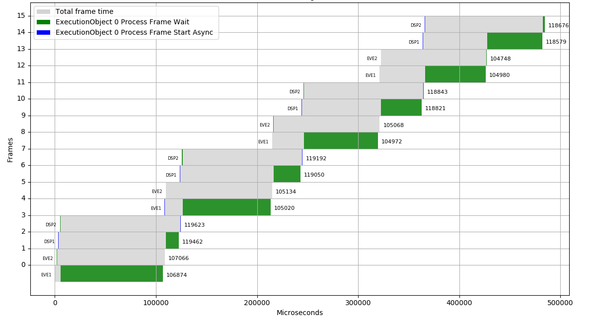

*******
Viewers
*******

Network graph viewer
++++++++++++++++++++

The TIDL network viewer utility, ``tidl_viewer``, can be used to view the network graph. If the ``dot`` utility is available, ``tidl_viewer`` uses it to convert the dot file to svg. ``dot`` is included in the ``Graphviz`` Ubuntu package and typically installed to ``/usr/bin/dot``.

For example, the following command will generate a dot graph description for the ``tidl_net_jdetNet_ssd.bin`` network binary in ``ssd.dot``.

.. code-block:: bash

    $ tidl_viewer examples/test/testvecs/config/tidl_models/tidl_net_jdetNet_ssd.bin -d ssd.dot

On x86/Linux, if ``/usr/bin/dot`` is available, ``tidl_viewer`` also generates an svg file, ``ssd.dot.svg``.

.. figure:: images/ssd.dot.svg
    :align: center
    :scale: 30
    :width: 30%
    :alt: SVG generated by dot

    svg file generated by tidl_viewer (click to enlarge)

.. note::
    If ``dot`` is not installed in ``/usr/bin/dot``, ``tidl_viewer`` will not convert the dot to svg. The following command can be used to generate the svg file as a separate step: ``dot -Tsvg ssd.dot -o ssd.dot.svg``. Additional information on ``Graphviz`` and ``dot`` available at:

    * `Graphviz <https://www.graphviz.org/>`_
    * `Ubuntu Graphviz package <https://packages.ubuntu.com/search?keywords=graphviz>`_

.. _execution-graph:

Execution Graph viewer
++++++++++++++++++++++

TIDL API v1.2 enables generation of a log file with timestamps for the following methods in the :term:`ExecutionObjectPipeline` and :term:`ExecutionObject` classes:

* ProcessFrameStartAsync (start)
* ProcessFrameStartAsync (end)
* ProcessFrameWait (start)
* ProcessFrameWait (end)

Add the following call to the TIDL API application to enable timestamp generation:

    .. code:: c++

        bool EnableTimeStamps(const std::string& file, size_t num_frames);

The generated log file can be viewed on x86/Linux by using the ``execution_graph.py`` script located at ``viewer/execution_graph.py``.

    .. code:: bash

        -> <install path>/viewer/execution_graph.py timestamp.log

:numref:`Execution Graph Output` shows the output of ``execution_graph.py`` for the ``one_eo_per_frame`` example when run on an AM5749 with 2 EVEs and 2 C66x DSPs:

.. _`Execution Graph Output`:

    Graph of frame index vs. execution time generated by execution_graph.py (click to enlarge)

.. note::
    ``execution_graph.py`` requires the Python `Matplotlib <https://matplotlib.org/users/installing.html>`_ module.

